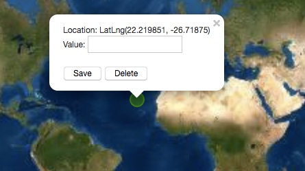

# one-mapper

Welcome to One Mapper. You can upload a csv file or create your own point data by clicking on the map. If you have a value associated with those points, you can visualize the value data into four groups.

## Table of Contents

[Why should I use One Mapper?](#Why-should-I-use-One-Mapper?) 
[Tutorial and example files](#Tutorial-and-example-files) 
[Making One Mapper](#making) 
[Data security](#data-security) 
[Other resources](#other-resources) 

### Why should I use One Mapper?

Does your data that looks like this?

  

And you want to create this?

Dataset used in this example from <a href="https://www.naturalearthdata.com/downloads/110m-cultural-vectors/" target="_blank">Natural Earth Data</a>, specifically <a href=" https://www.naturalearthdata.com/http//www.naturalearthdata.com/download/110m/cultural/ne_110m_populated_places_simple.zip" target="_blank">Populated Places, Download simple (less columns)</a> (39.45 KB) version 4.1.0.

Please ask yourself the following questions:
* Do I have geographic data that I want to map?
* Does my geographic data have values like 38.0406 and -84.5037?
* Do I want to create an initial map to see where the points are located and how values may change by location?

If you answered Yes to these questions, then One Mapper may be a good place to start! I would like your map to be a positive jumping off point that says "Welcome to the absolutely fascinating world of mapping! Everyone is welcome!"

One Mapper performs the following functions:

<b>If you are loading in a dataset</b>
* A csv file that contains latitude, longitude, and some value of interest. 
* Latitude and longitude must be recorded in WGS 84 (EPSG 4326) in decimal degrees. This approach was selected because it's a common data type used by other widely used online map programs and by handheld GPS units.

<b>If you are creating points on the map</b>
* No need to upload data, you can use the map itself.

### Tutorial and example files

Here are two example files to use with One Mapper.

* <b>Street Tree Dataset:</b>
This dataset comes from the City of Cambridge, Massachusetts 
<a href="https://www.cambridgema.gov/GIS/gisdatadictionary/Environmental/ENVIRONMENTAL_StreetTrees" target="_blank">Trees</a> database that is maintained by Cambridge Public Works. The layer data was downloaded, opened in QGIS, coordinates were converted to WGS 84 (EPSG: 3857), and the layer was exported as a csv. The csv was edited so that the only columns remaining were latitude, longitude, and tree diameter at base height (measured in inches).

This edited dataset is available <a href="data/Cambridge_Tree">here</a>.

* <b>Bangladesh Water Arsenic Dataset:</b>
This dataset comes from the British Geological Survey 
<a href="https://www.bgs.ac.uk/research/groundwater/health/arsenic/Bangladesh/data.html" target="_blank">Arsenic contamination of groundwater in Bangladesh: data</a>. The specific file used was the <a href="https://www.bgs.ac.uk/downloads/start.cfm?id=2214">DPHE/BGS National Hydrochemical Survey csv</a> file. The csv file was edited so that there were three columns remaining, latitude, longitude, and the water arsenic concentration (measured in micrograms per liter). In the dataset, some water arsenic values were listed as below certain detection limits, such as &#60;6 or &#60;0.5. One Mapper needs an entire column of numeric values, so any value with the &#60; symbol was converted to that value. For example a listed value of &#60;6 was changed to 6.

This edited dataset is available <a href="data/BGS_As">here</a>.

To test out these datasets:

1. Go to <a href="#" target="_blank">One Mapper</a>
2. Scroll down the page until you see this:

3. Type in a short description of the dataset, for example, "Trees in Cambridge, MA" or "Water Arsenic in Bangladesh"

4. Type in a variable name, such as "DBH (in)" or "Water Arsenic (mcg/L)"

5. Click the browse button and select the file you want to load in.

6. After loading in the data, you should see something similar to this (using the Bangladesh data):

7. You loaded in 3,534 data points and they are all visualized on the map. If you zoom in on the map, you'll see separate points for each value that was loaded in. You can click on those points to see the value too.

8. Now click the Map Values! button. The plotted colors will change and the map will zoom out. You can adjust the zoom using the navigation button in the upper left corner, or by clicking on the map, or may zooming in/out on a trackpad.

Note that the title you entered on the right side of the page is now the title of your map and the value field you entered is now listed on the legend.

9. If you'd like to make another map using a different dataset, click the Clear Map button on the top of the right side panel. The page will reset and you can start mapping again!

<b>Create your own dataset:</b>
You may be interested in creating a map using One Mapper rather than uploading an existing dataset.

1. Go to <a href="#" target="_blank">One Mapper</a>
2. Scroll down the page until you see this:

3. Complete the Short title/description page and the variable name section. 

4. Skip the browse button and instead scroll down until you see the following:

5. Click the Add Points button. 

6. When you click on the map, you'll notice that a point is created. If you click the point again, you can now enter data.

******** These next steps are currently under development *********

7. This next piece of One Mapper functionality is still in development. You will be able to try in a value and click Save, and the value will be saved.

8. You can add as many points as you would like to the map.

If you look to the right side of the page, you will see how many points you've added.

9. If you click Generate Map, the plotted colors will change and the map will zoom out. You can adjust the zoom using the navigation button in the upper left corner, or by clicking on the map, or may zooming in/out on a trackpad.

10. If you'd like to make another map using a different dataset, click the Clear Map button on the top of the right side panel. The page will reset and you can start mapping again!

### Making One Mapper

This section provides some additional information about One Mapper. You are also welcome to check out the code too.

One Mapper was initially created as part of a course at the University of Kentucky, MAP673. This course is part of the <a href="https://newmapsplus.as.uky.edu/" target="_blank">NewMapsPlus</a> curriculum. 

One Mapper primarily uses <a href="https://leafletjs.com/" target="_blank">Leaflet</a>, and also includes other great libraries including:

* Additional website styling with <a href="https://getbootstrap.com/" target="_blank">Bootstrap</a>
* Fonts used from <a href="https://fonts.google.com/" target="_blank">Google Fonts</a>
* Other code from <a href="https://code.jquery.com/" target="_blank">jquery</a>
* The csv file is parsed using <a href="https://www.papaparse.com/" target="_blank">Papa Parse</a>
* The statistics are calculated using <a href="https://simplestatistics.org/" target="_blank">Simple Statistics</a>, specifically the ckmeans clustering. This type of clustering is similar to Jenks and creates groups based on similar values rather than by value ordering that occurs with quartiles. As Simple Statistics <a href="https://simplestatistics.org/docs/#ckmeans" target="_blank">notes</a>: "clustering numeric data into groups with the least within-group sum-of-squared-deviations."
* The color scheme used on the map is from <a href="https://colorbrewer2.org" target="_blank">Color Brewer</a>
 
One Mapper creates datapoints that are uploaded or points created on the map. The data are converted into JSON and then visualized on the map. The values associated with those points are categorized using the ckmeans function from Simple Statistics. Then the values are split into 4 groups and the colors are applied.

### Data Security

The mapping site is hosted on GitHub Pages. According to the <a href="https://help.github.com/en/github/site-policy/github-privacy-statement">GitHub Privacy Policy</a>, "If you create a GitHub Pages website, it is your responsibility to post a privacy statement that accurately describes how you collect, use, and share personal information and other visitor information, and how you comply with applicable data privacy laws, rules, and regulations. Please note that GitHub may collect User Personal Information from visitors to your GitHub Pages website, including logs of visitor IP addresses, to comply with legal obligations, and to maintain the security and integrity of the Website and the Service."

I am interested in collecting the following data from you:
* Total number of page visitors
* Total number of respository downloads
Reason: I would like to know if One Mapper is helpful to others.

I am not collecting:
* Your IP address
* The data that you enter to the page
Reason: It's your data and your map.

From the Privacy Policy above, GitHub may separately collect some information for the overall GitHub service.

Another option for you to consider is to download this repository and host it locally on your computer. You can use One Mapper on your own computer without acccess this GitHub Pages site. 

### Other resources

There are lots of other great mapping programs available. One Mapper is meant to help you get started looking at your data, and from there you may be interested in several options for more advanced functionality. I do not receive compensation from these organizations for listing their links below.

* <a href="http://geojson.io/" target="_blank">geojson.io</a>
* <a href="http://geodacenter.github.io/index.html" target="_blank">GeoDa</a>
* <a href="https://qgis.org/en/site/QGIS" target="new">QGIS</a>
* <a href="https://desktop.arcgis.com/en/arcmap/" target="_blank">ESRI ArcGIS</a>
* <a href="https://cengel.github.io/rspatial/" target="_blank">Spatial analysis in R</a> (many R options, here's one example)
* <a href="https://www.kobotoolbox.org/" target="_blank">KoBoToolbox</a> includes maps as one option within a larger data collection environment
